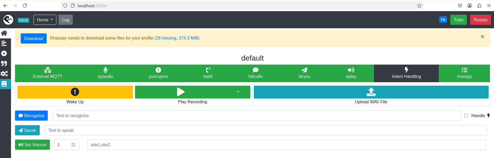

# Smart Speaker Codebase

## Description
Our project aims to develop a Smart Speaker that operates primarily in a closed (offline) environment without continuous Internet access. This is a proof of concept (PoC) to validate the feasibility of providing voice assistant functionality - such as speech recognition (STT), speech synthesis (TTS), and basic command processing - entirely within a user’s local network or infrastructure.

## Project Setup

1. Run VM with Ubuntu-22.04 or any Debian-like Linux.
2. Be sure that you install docker and your user is part of the `docker` group.
3. Install the Mosquitto (MQTT Broker)
```
sudo apt update
sudo apt install -y mosquitto
```
4. By defauls mosquitto.service runs after the installation, but rather check the status.
```
sudo systemctl status mosquitto
```
5. If service not running try comand below and check the status:
```
sudo systemctl enable mosquitto
sudo systemctl start mosquitto
```
6. Run:
```
chmod +x docker-run.sh
./docker-run.sh
```
7. Rhasspy is now running! Access it at http://localhost:12101.
8. After reaching Rhasspy web interface, download the all necessary dependencies by clicking Download button.



9. When downloading process ends click Train and then Restart buttons.

To get more info read [the Rhasspy docs](https://rhasspy.readthedocs.io/en/latest/).
 
## Project Documentation
All project documentation is stored in our Notion workspace: [Smart Speaker Documentation](https://www.notion.so/OMP-Smart-Speaker-18dc9732b84e8021be03dc82e5499f54?pvs=4).

## GitLab workflow conventions
For our GitLab-Flow conventions, please refer to the documentation here: [GitLab-Flow Conventions](https://www.notion.so/GitLab-Flow-196c9732b84e8090ae7fedfe7b001137?pvs=4).

## Project status
🚀 Active - Development is ongoing with regular updates.
